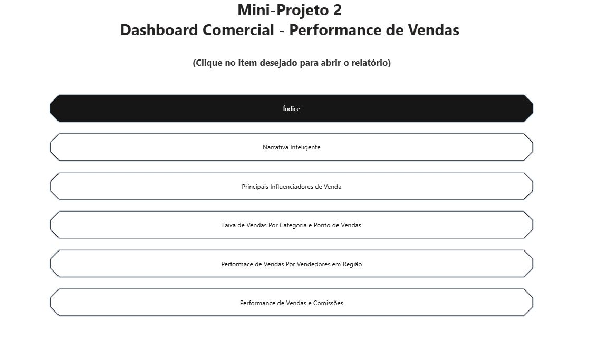

# Performance de Vendas e Comissões
# 📌 Visão Geral
Este dashboard foi desenvolvido para fornecer uma visão 360º da operação comercial de uma empresa. O foco principal é monitorar o desempenho dos vendedores por região, identificar fatores que influenciam as vendas através de IA e automatizar o cálculo de comissões, transformando dados brutos em decisões ágeis para a gerência.

# 📸 Interface do Projeto
O relatório conta com um sistema de navegação por botões que permite explorar diferentes níveis de detalhamento.

<p align="center">
<b>Menu Principal (Índice de Navegação)</b>



</p>

<p align="center">
<b>Performance de Vendas e Comissões</b>


</p>

<p align="center">
<b>Análise de Influenciadores de Venda (IA)</b>


</p>


<p align="center">
  <b>Fluxo de Vendas por Categoria e Ponto de Venda</b><br>
  
</p>

<p align="center">
  <b>Insights Automáticos (Narrativa Inteligente com IA)</b><br>
  
</p>

<p align="center">
  <b>Análise Geográfica de Performance por Vendedor</b><br>
  
</p>


# 📊 Inteligência de Dados & DAX
A automação financeira do dashboard foi alcançada através da linguagem DAX, com destaque para o cálculo dinâmico de comissões, que elimina erros manuais e fornece transparência para o time de vendas.

Métrica de Comissão:

```
Comissao Pago = SUM(Vendas[Valor de Venda]) * 0.02
```

A lógica aplicada assume uma taxa fixa de 2% sobre o volume total de vendas, permitindo que o gráfico "Total de Comissão Paga por Vendedor" seja atualizado instantaneamente conforme os filtros de data ou região são aplicados.

# 🔍 Funcionalidades e Insights

**Narrativa Inteligente:** Implementação de resumos automáticos que interpretam os dados (ex: Brastemp liderando o valor de venda com 25,82% de participação).

**Principais Influenciadores:** Uso de visual de IA para identificar que o segmento "Corporativo" é o que mais positivamente influencia a média de valor de venda.

**Gestão Geográfica:** Mapa de calor que detalha a performance de vendedores específicos (como André Pereira e Artur Moreira) em estados como São Paulo e Rio de Janeiro.

**Análise de Mix de Produtos:** Matriz detalhada com o Top 3 de produtos vendidos (Geladeira Duplex, Motorola Moto G5 e Samsung Galaxy 8) por estado.

# 🛠️ Tecnologias Utilizadas

**Power BI:** Construção de dashboards e publicação de relatórios.

**DAX:** Desenvolvimento de medidas para KPIs financeiros.

**AI Visuals:** Implementação de Narrativa Inteligente e Influenciadores Principais.

**Modelagem de Dados:** Estruturação de tabelas de vendas e vendedores para suporte à análise regional.
